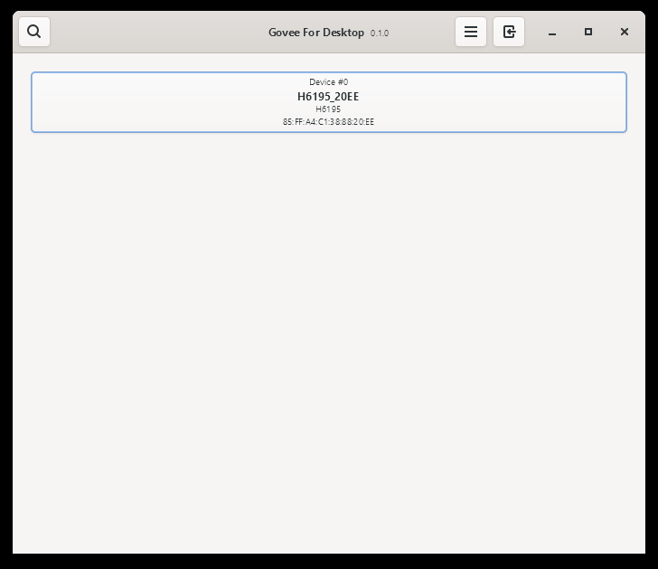
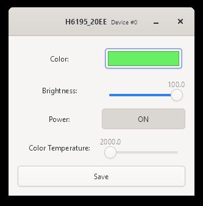
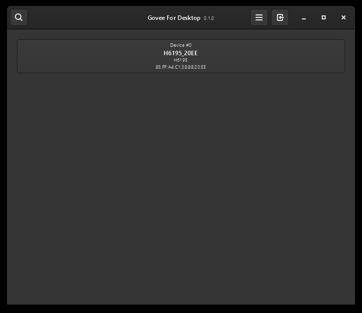
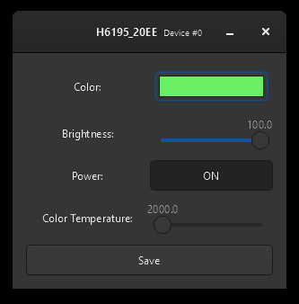

Govee for Desktop
=================
A desktop client for controlling Govee light strips.

How to get your Govee API Key
-----------------------------
Having your Govee API Key is needed to use this app. To get it, if you haven't already,
download and open the [Govee Home](https://play.google.com/store/apps/details?id=com.govee.home) mobile app.

Then, follow these instructions:
1. In the navigation bar on the bottom, go to your profile
2. Click on the gear on the top right of the screen to go to your settings page
3. Near the bottom, click on the "`About Us`" button
4. Then tap on "`Apply for API Key`"
5. Fill out the form your are provided with then click "`Submit`"

You will be emailed by Govee with your API key soon.

Supported Govee Devices
-----------------------
Unfortuntely, not all devices are supported. Only the following devices are supported:

H6160, H6163, H6104, H6109, H6110, H6117, H6159, H7022, H6086, H6089, H6182, H6085, H7014, H5081, H6188, H6135, H6137,
H6141, H6142, H6195, H7005, H6083, H6002, H6003, H6148, H6052, H6143, H6144, H6050, H6199, H6054, H5001, H6050, H6154,
H6143, H6144, H6072, H6121, H611A, H5080, H6062, H614C, H615A, H615B, H7020, H7021, H614D, H611Z, H611B, H611C, H615C,
H615D, H7006, H7007, H7008, H7012, H7013, H7050, H6051, H6056, H6061, H6058, H6073, H6076, H619A, H619C, H618A, H618C,
H6008, H6071, H6075, H614A, H614B, H614E, H618E, H619E, H605B, H6087, H6172, H619B, H619D, H619Z, H61A0, H7060, H610A,
H6059, H7028, H6198, H6049.

Only Wi-Fi deviced are supported

GUI Screenshots
---------------
### Light Mode

### Dark Mode

### High Contrast
There are also additional high-contrast themes supported in the app.

Non-Affiliation Disclaimer
--------------------------
I am not affiliated, associated, authorized, endorsed by, or in any way officially connected with Govee, 
or any of its subsidiaries or its affiliates. The official Govee website can be found at https://govee.com
and their mobile app at https://play.google.com/store/apps/details?id=com.govee.home

###### Made with ❤️ with Nim and GTK
